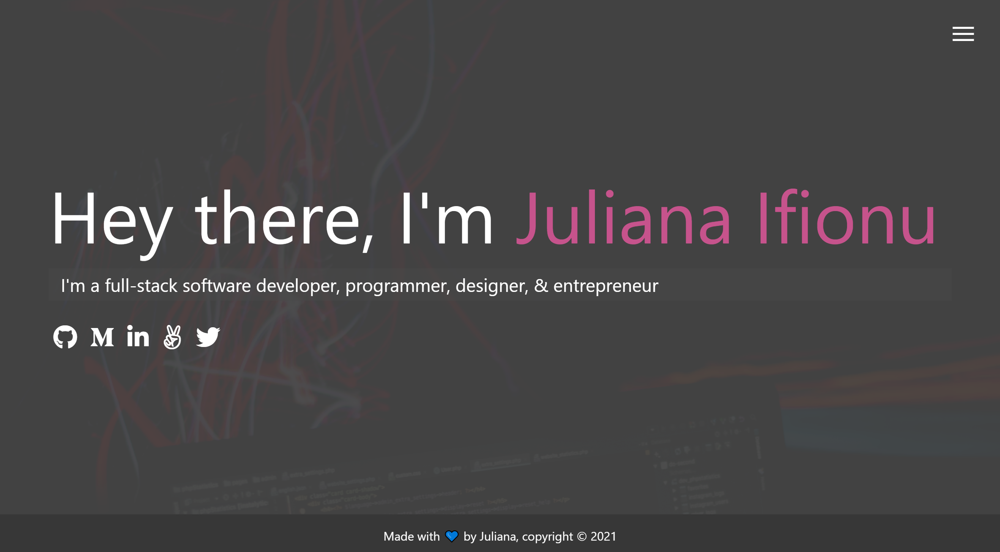

# Portolio website where you get to know me, my works and how to get in touch with me.

> 

This project entails Building a responsive portfolio website which showcase my bio, projects I have worked on and how to contact me.

## Built With

- HTML
- CSS
- Javascript
- SCSS

## Live Demo

[Live Demo Link](https://julie-ify.github.io/myportfolio/)

## Getting Started

To get a local copy up and running follow these simple steps.

- You can clone this repo by typing `git clone https://github.com/julie-ify/myportfolio.git` on your terminal
- Type `cd myportfolio` to access the project on the terminal

## Author

👤 **Ifionu Juliana** 💖

- [GitHub](https://github.com/julie-ify)
- [LinkedIn](https://www.linkedin.com/in/e-ifionu/)
- [Twitter](https://twitter.com/juliana_ifionu)

## 🤝 Contributing

Contributions, issues, and feature requests are welcome!

Feel free to check the [issues page](https://github.com/julie-ify/myportfolio/issues).

## Show your support

Give a ⭐️ if you like this project!

## 📝 License

This project is [MIT](./MIT.md) licensed.